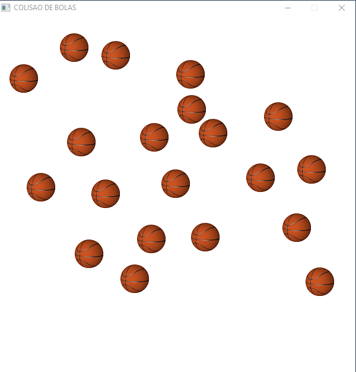

## Colisao-de-Bolas
2D Ball Collision Simulator using SDL2 and C++.

### Compilation for Windows

* Download and extract SDL (version 2.0.18) and SDL_image (version 2.0.5) into the "C:/" folder (if using other versions or folders, change CMakeLists.txt);
* Run CMake.

### Running Screenshot

